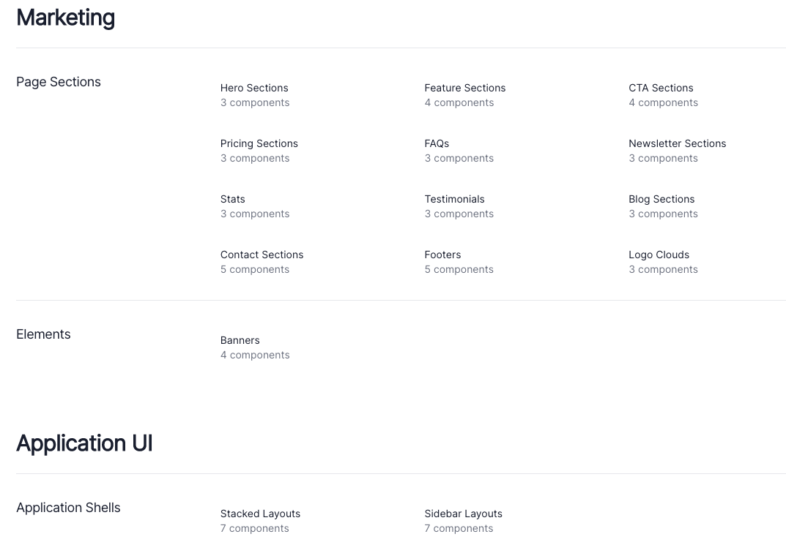
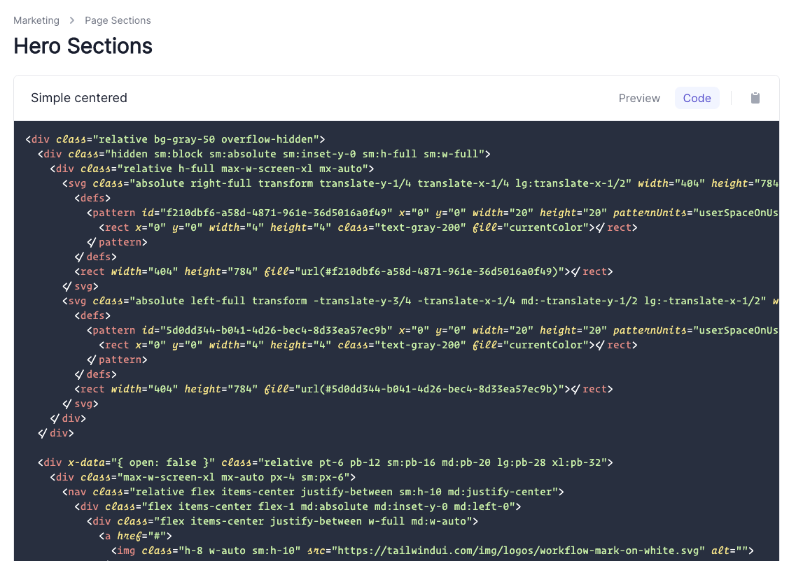

# tailwindui-crawler

<!-- ALL-CONTRIBUTORS-BADGE:START - Do not remove or modify this section -->

[](#contributors-)

<!-- ALL-CONTRIBUTORS-BADGE:END -->


This script will crawl the [tailwindui.com](https://tailwindui.com) website and download all the
component HTML to the `./output` folder.

## 🛠 How to use

To install, clone this repo and run `yarn` to pull down the dependencies.

Then create a `.env` file with your email, password, and optional output folder.

```ini
EMAIL=youremail
PASSWORD=yourpassword
OUTPUT=/path/to/output # optional, defaults to ./output
HTMLMODE=alpine|comments # save HTML with alpine (default) or comments
TRANSFORMERS=... # comma-delimited list of transformers (see below)
BUILDINDEX=(0 | 1)  # generate index file to view components offline
```

### ✨ New in v2.3

The Tailwind UI components have removed the Alpine.js code from the HTML. The
crawler now includes a `HTMLMODE` setting to include either the Alpine.js code
(`alpine` default) or download with HTML comments (`comments`).

There are also new transformers to change the color and logo of the HTML components.

> NOTE: The tool uses [dotenv-expand](https://github.com/motdotla/dotenv-expand) to support variable expansion like `$HOME/path/to/output`
> so if your password or any other value includes a `$`, make sure you add a `\` (backslash) to
> escape the `$`. For example, `PASSWORD=p@\$\$w0rd`

Then finally, run `yarn start`

The script will login to [tailwindui.com](https://tailwindui.com) with your credentials, and download all the
components as individual HTML files in the `./output` folder.

## 🤔 What's it for?

The benefit of pulling down all the components is that you can commit them to a local or
private repo, and by running this periodically, you can see exactly which files were added
or changed. Hopefully, some time in the future, they will open up a private repo for those
that have purchased the library.

## 🚀 New v2.0

The crawler has been re-written to make it easier to update the processing pipeline by simply
adding a new transformer function.

It also adds the ability to generate an index page that emulates the [tailwindui.com](https://tailwindui.com) website
so you can browse components offline.

### 🔄 Transformers

Each transformer is simply a JavaScript file (in `./transformers` folder) that exports a
function to be called from the processing pipeline. Each transformer will take a [cheerio](https://github.com/cheeriojs/cheerio)
instance (basically a jQuery-like interface) which enables the transformer to update the
generated HTML. The crawler will call each transformer in turn, then writes the final HTML file.

To add a new transformer, update the `TRANSFORMERS` key in the `.env` file. This is a comma-delimited
list of transformers. The crawler will call each transformer in the specified order.

The following transformers are availble:

<table>
<thead>
<tr><th>Transformer</th><th>Description</th></tr>
</thead>
<tbody>
<tr style="vertical-align: baseline;"><td><code>addTailwindCss</code></td><td>Adds link to tailwindui.css</td></tr>
<tr style="vertical-align: baseline;"><td><code>prefixSrc</code></td><td>Adds <code>https://tailwindui.com</code> to any img src attribute that needs it</td></tr>
<tr style="vertical-align: baseline;"><td><code>useInter</code></td><td>Adds link to Inter font css and styles</td></tr>

<tr style="vertical-align: baseline;"><td><code>convertVue</code></td><td>Converts HTML component into a Vue component
<ul><li>Use <code>.env</code> key <code>VUE_OUTPUT</code> to specify which folder to save the Vue files to (defaults to currently
configured <code>OUTPUT</code>)</li>
<li>This transformer will create a Vue component for each Tailwind UI component. This components may need some adjustements,
but should in most cases be ready to go. An index script is not included, so the components can't be viewed in the browser yet.</li>
</ul></td></tr>

<tr style="vertical-align: baseline;"><td><code>convertReact</code></td><td>Converts HTML component into React/JSX-compatible syntax
<ul><li>Use <code>.env</code> key <code>CONVERTREACT_OUTPUT</code> to specify which folder to save the React files to
(defaults to currently configured <code>OUTPUT</code>).</li>
<li>This transformer will create a folder for each component with an <code>index.js</code> file (this is the React component) and an <code>index.html</code>
page which is a simple wrapper that will load the React component to verify it is working. NOTE: The transformer does not currently update the
<code>alpine.js</code> code, so the component does not support state or interactivity. However, that is on the TODO list.</li>
<li>You can use <a href="https://parceljs.org">Parcel</a> to test the React component.</li>
<li>Based on <a href="https://gist.github.com/RobinMalfait/a90e8651196c273dfa51eec0f43e1676">gist</a> by <a href="https://github.com/RobinMalfait">@RobinMalfait</a></li>
</ul></td></tr>

<tr style="vertical-align: baseline;"><td><code>stripAlpine</code></td><td>Removes all the Alpine.js attributes from the markup
<ul><li>Use <code>.env</code> key <code>STRIPALPINE_OUTPUT</code> to specify which folder to save the files to. You must
specify the output folder to ensure the raw HTML files are not overwritten</li>
</ul></td></tr>
<tr style="vertical-align: baseline;"><td>✨ <code>changeColor</code> (v2.3)</code></td><td>Changes the default color from <code>indigo</code> to value in <code>CHANGECOLOR_TO</code></td></tr>
<tr style="vertical-align: baseline;"><td>✨ <code>changeLogo</code> (v2.3)</code></td><td>Changes the logo image from the generic to URL in <code>CHANGELOGO_URL</code></td></tr>
</tbody>
</table>

### 🗂 Index page

You can set the `.env` key `BUILDINDEX=1` to have the crawler generate an index file similar to the components
page on [tailwindui.com](https://tailwindui.com). Install and run the [serve](https://www.npmjs.com/package/serve) package
to view the index.

```bash
yarn add -g serve
serve
```

---

#### Main index page



---

#### Component section page


---

#### Click button to view syntax highlighted code



---

You can view each component and the highlighted code. Currently resizing and copying code is not supported.

### ⚙️ Example `.env` file

```ini
EMAIL=******
PASSWORD=******
OUTPUT=$HOME/Projects/oss/tailwindui
BUILDINDEX=1
TRANSFORMERS=addTailwindCss,prefixSrc,useInter,convertReact,stripAlpine
VUE_OUTPUT=$OUTPUT/vue
CONVERTREACT_OUTPUT=$OUTPUT/react
STRIPALPINE_OUTPUT=$OUTPUT/no-alpine
```

## 🚦 Upgrading to v2.

Since the transformers can make a lot of changes to the files, I would recommend
you run the current crawler first to generate the diffs and commit those. Then upgrade
and run with transformers enabled. This way you're not mixing up changes.

NOTE: Since this script is essentially screen scraping, there's the potential
of it breaking if the HTML structure changes. I will do my best to keep it in sync with
the website.

## 😍 Thank you

Thanks to Adam and Steve for making an amazing library. This has definitely made creating
a UI for my applications a pleasant experience.

Enjoy and let me know if you have any questions.

Kiliman

## Contributors ✨

Thanks goes to these wonderful people ([emoji key](https://allcontributors.org/docs/en/emoji-key)):

<!-- ALL-CONTRIBUTORS-LIST:START - Do not remove or modify this section -->
<!-- prettier-ignore-start -->
<!-- markdownlint-disable -->
<table>
  <tr>
    <td align="center"><a href="https://github.com/kiliman"><br /><sub><b>Kiliman</b></sub></a></td>
    <td align="center"><a href="http://www.cemfi.de"><br /><sub><b>Simon Waloschek</b></sub></a></td>
    <td align="center"><a href="https://github.com/nawok"><br /><sub><b>Pavel Fomchenkov</b></sub></a></td>
    <td align="center"><a href="https://robinmalfait.com"><br /><sub><b>Robin Malfait</b></sub></a></td>
    <td align="center"><a href="https://miguelpiedrafita.com"><br /><sub><b>Miguel Piedrafita</b></sub></a></td>
  </tr>
</table>

<!-- markdownlint-enable -->
<!-- prettier-ignore-end -->

<!-- ALL-CONTRIBUTORS-LIST:END -->

This project follows the [all-contributors](https://github.com/all-contributors/all-contributors) specification. Contributions of any kind welcome!
