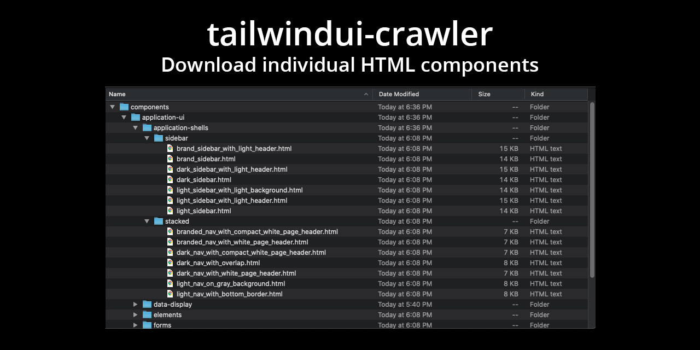

# tailwindui-crawler

<!-- ALL-CONTRIBUTORS-BADGE:START - Do not remove or modify this section -->

[](#contributors-)

<!-- ALL-CONTRIBUTORS-BADGE:END -->



This script will crawl the [tailwindui.com](https://tailwindui.com) website and download all the
components to the `./output` folder.

## 🛠 How to use

To install, clone this repo and run `yarn` or `npm install` to pull down the dependencies.

Then create a `.env` file with your email, password, and optional output folder.

```ini
EMAIL=youremail
PASSWORD=yourpassword
# OUTPUT optional, defaults to ./output
OUTPUT=/path/to/output
# LANGUAGES defaults to html
LANGUAGES=html,react,vue,alpine
# BUILDINDEX generate index file to view components offline
BUILDINDEX=(0 | 1)
# TEMPLATES download template files
TEMPLATES=(0 | 1)
```

> NOTE: The tool uses [dotenv-expand](https://github.com/motdotla/dotenv-expand)
> to support variable expansion like `$HOME/path/to/output` so if your password
> or any other value includes a `$`, make sure you add a `\` (backslash) to
> escape the `$`. For example, `PASSWORD=p@\$\$w0rd`
>
> Also, `dotenv` does **not** support inline comments, so do not do something
> like `LANGUAGES=html,react,vue # some comment` as it will not get the correct
> values.

Then finally, run `yarn start` or `npm start`

The script will login to [tailwindui.com](https://tailwindui.com) with your credentials, and download all the
components as individual files in the `./output` folder.

## 🤔 What's it for?

The benefit of pulling down all the components is that you can commit them to a local or
private repo, and by running this periodically, you can see exactly which files were added
or changed. Hopefully, some time in the future, they will open up a private repo for those
that have purchased the library.

## 🚀 New v4.0

The crawler has been updated to support the new Tailwind UI site as of 2022-06-27. You can
also download the new Page Templates. Add `TEMPLATES=1` to your _.env_ file. If you are using the GitHub action to crawl, you will need to update your deploy.yml. See instructions below.

The crawler now supports the new Tailwind UI site and can download HTML, React
and Vue versions of the components.

You can also download the "alpine" version of the components. ⚠️ WARNING: the
alpine code is **NOT** production ready. It does not support accesibility and
is used to show a preview of how the component interactivity can be implemented.

It also adds the ability to generate an index page that emulates the [tailwindui.com](https://tailwindui.com) website
so you can browse components offline.

### 🗂 Preview page

You can set the `.env` key `BUILDINDEX=1` to have the crawler generate an index file similar to the components
page on [tailwindui.com](https://tailwindui.com). Install and run the [serve](https://www.npmjs.com/package/serve) package
to view the index.

> NOTE: The HTML Preview does not apply transformers. It's a copy of the
> component site on [tailwindui.com](https://tailwindui.com).

```bash
yarn global add serve
cd $OUTPUT/preview # change to your preview folder
serve
```

### ⚙️ Example `.env` file

```ini
EMAIL=******
PASSWORD=******
OUTPUT=$HOME/Projects/tailwindui
LANGUAGES=html,react,vue,alpine
BUILDINDEX=1
TEMPLATES=1
```

## 🤖 Automatically keep a **private** GitHub Repository up-to-date

**NOTE**: GitHub action has been updated in v4.0.0. Please make sure your _default.yml_ file is updated with the latest actions.

You can automatically keep a **private** GitHub repository up-to-date with component changes from TailwindUI by using this tool with GitHub Actions.

1. [Create a **private** GitHub repository](https://github.com/new/).
1. [Add `TAILWINDUI_EMAIL` and `TAILWINDUI_PASSWORD` secrets to the GitHub repository](https://help.github.com/en/actions/configuring-and-managing-workflows/creating-and-storing-encrypted-secrets#creating-encrypted-secrets).
1. [Optionally create a `.env` file with additional settings for the crawler](#%EF%B8%8F-example-env-file).
1. Create a new file `.github/workflows/default.yml`:

   ```yml
   name: Update
   on:
     schedule:
       - cron: '0 0 * * *' # Every day at midnight

   jobs:
     update:
       name: Update
       runs-on: ubuntu-latest
       steps:
         - name: Checkout
           uses: actions/checkout@v2
         - name: Run crawler
           uses: kiliman/tailwindui-crawler-action@v1.3.0
           with:
             email: ${{ secrets.TAILWINDUI_EMAIL }}
             password: ${{ secrets.TAILWINDUI_PASSWORD }}
   ```

   > NOTE: Make sure to update to the latest action `v1.1.0` to support the crawler v3+

   Read more about the schedule cron syntax in [the official GitHub Actions documentation](https://help.github.com/en/actions/reference/events-that-trigger-workflows#scheduled-events-schedule).

   > NOTE: if you're creating a new repository or have updated your default branch from `master`, you will have to specify with `branch` (and/or `current_branch`) like so:

   ```diff
   # ...
         - name: Run crawler
           uses: kiliman/tailwindui-crawler-action@v1.3.0
           with:
             email: ${{ secrets.TAILWINDUI_EMAIL }}
             password: ${{ secrets.TAILWINDUI_PASSWORD }}
   +         branch: main
   +         current_branch: main
   ```

### Email Notifications

To be emailed whenever there is a change to a component, simply setup [GitHub Notifications](https://help.github.com/en/github/administering-a-repository/about-email-notifications-for-pushes-to-your-repository#enabling-email-notifications-for-pushes-to-your-repository) on your repository.

## 🚦 Upgrading to v3.

This is a major change. Unfortunately, v2 will no longer work with the existing
site due to the updates they may to add support for React/Vue components. Please also note that the [GitHub Action](#-automatically-keep-a-private-github-repository-up-to-date) has been updated from `v1.0.0` to `v1.1.0`.

Currently, there is no support for transformers, as the need for them is not
as critical since the components don't need to be converted to React or Vue.

NOTE: Since this script is essentially screen scraping, there's the potential
of it breaking if the HTML structure changes. I will do my best to keep it in sync with
the website.

## 😍 Thank you

Thanks to Adam and Steve for making an amazing library. This has definitely made creating
a UI for my applications a pleasant experience.

Enjoy and let me know if you have any questions.

Kiliman

## Contributors ✨

Thanks goes to these wonderful people ([emoji key](https://allcontributors.org/docs/en/emoji-key)):

<!-- ALL-CONTRIBUTORS-LIST:START - Do not remove or modify this section -->
<!-- prettier-ignore-start -->
<!-- markdownlint-disable -->
<table>
  <tr>
    <td align="center"><a href="https://github.com/kiliman"><br /><sub><b>Kiliman</b></sub></a><br /><a href="https://github.com/kiliman/tailwindui-crawler/commits?author=kiliman" title="Code">💻</a></td>
    <td align="center"><a href="http://www.cemfi.de"><br /><sub><b>Simon Waloschek</b></sub></a><br /><a href="https://github.com/kiliman/tailwindui-crawler/commits?author=sonovice" title="Code">💻</a></td>
    <td align="center"><a href="https://github.com/nawok"><br /><sub><b>Pavel Fomchenkov</b></sub></a><br /><a href="https://github.com/kiliman/tailwindui-crawler/commits?author=nawok" title="Code">💻</a></td>
    <td align="center"><a href="https://robinmalfait.com"><br /><sub><b>Robin Malfait</b></sub></a><br /><a href="https://github.com/kiliman/tailwindui-crawler/commits?author=RobinMalfait" title="Code">💻</a></td>
    <td align="center"><a href="https://miguelpiedrafita.com"><br /><sub><b>Miguel Piedrafita</b></sub></a><br /><a href="https://github.com/kiliman/tailwindui-crawler/commits?author=m1guelpf" title="Code">💻</a> <a href="https://github.com/kiliman/tailwindui-crawler/commits?author=m1guelpf" title="Documentation">📖</a> <a href="#ideas-m1guelpf" title="Ideas, Planning, & Feedback">🤔</a></td>
    <td align="center"><a href="https://github.com/vladdu"><br /><sub><b>Vlad Dumitrescu</b></sub></a><br /><a href="https://github.com/kiliman/tailwindui-crawler/commits?author=vladdu" title="Documentation">📖</a></td>
    <td align="center"><a href="https://github.com/vesper8"><br /><sub><b>C-Bass</b></sub></a><br /><a href="https://github.com/kiliman/tailwindui-crawler/commits?author=vesper8" title="Code">💻</a></td>
  </tr>
  <tr>
    <td align="center"><a href="https://gregbrimble.com/"><br /><sub><b>Greg Brimble</b></sub></a><br /><a href="https://github.com/kiliman/tailwindui-crawler/commits?author=GregBrimble" title="Documentation">📖</a> <a href="#tool-GregBrimble" title="Tools">🔧</a></td>
    <td align="center"><a href="https://github.com/yagnik"><br /><sub><b>Yagnik</b></sub></a><br /><a href="https://github.com/kiliman/tailwindui-crawler/commits?author=yagnik" title="Code">💻</a></td>
  </tr>
</table>

<!-- markdownlint-restore -->
<!-- prettier-ignore-end -->

<!-- ALL-CONTRIBUTORS-LIST:END -->

This project follows the [all-contributors](https://github.com/all-contributors/all-contributors) specification. Contributions of any kind welcome!
